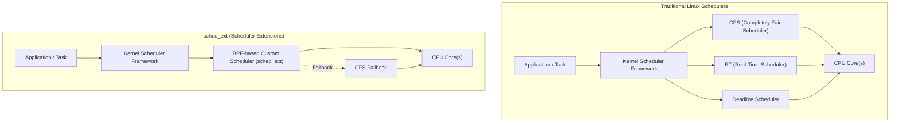
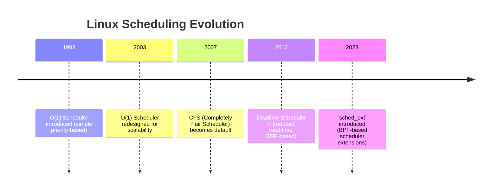

# 1. Overview of `sched_ext`

## 1.1 Definition and Purpose

`sched_ext` (Scheduler Extensions) is a **Linux kernel framework** that allows developers to implement and experiment with **custom scheduling policies** in a safe, modular, and flexible manner.

Traditionally, Linux has provided a few built-in scheduling classes such as:

- **CFS (Completely Fair Scheduler)** – default for general-purpose workloads  
- **RT (Real-Time)** – for low-latency, deterministic workloads  
- **Deadline Scheduler** – for tasks with strict deadlines  

While these schedulers cover a wide range of use cases, they are **hard-coded into the kernel**. Creating a new scheduler traditionally required patching and recompiling the kernel — a process that is complex, error-prone, and not suitable for rapid prototyping.

`sched_ext` solves this problem by:

- Allowing schedulers to be written in **eBPF (Extended Berkeley Packet Filter)** programs  
- Running these schedulers in a **safe sandbox environment**  
- Providing a **plug-and-play mechanism** for custom scheduling policies without modifying the kernel core  

👉 In essence, `sched_ext` turns Linux scheduling into a **flexible, programmable platform**.  

## 1.2 Differences from Traditional Schedulers

| **Aspect**              | **Traditional Linux Schedulers (CFS, RT, Deadline)** | **sched_ext** |
|--------------------------|------------------------------------------------------|---------------|
| **Implementation**       | Built directly into kernel code                      | Implemented via eBPF programs |
| **Flexibility**          | Fixed policies (must modify kernel for new ones)     | User-defined schedulers can be loaded/unloaded dynamically |
| **Safety**               | Kernel-level changes require careful testing         | eBPF verifier ensures safety before scheduler runs |
| **Experimentation**      | Difficult, requires recompiling kernel               | Rapid prototyping possible with BPF |
| **Fallback Mechanism**   | N/A (fixed schedulers only)                          | Can fall back to default scheduler if extension fails |

## 1.3 Key Advantages and Limitations

### ✅ Advantages
- **Rapid Prototyping** – developers can quickly test new scheduling algorithms without recompiling the kernel.  
- **Flexibility** – supports workload-specific policies (e.g., gaming, AI/ML, cloud scheduling).  
- **Safety** – eBPF verification ensures that faulty code cannot crash the kernel.  
- **Dynamic Loading/Unloading** – schedulers can be swapped at runtime without rebooting.  
- **Fallback to Default** – if a custom scheduler fails, the system safely reverts to CFS.  

### ⚠️ Limitations
- **Experimental Nature** – still under development and not enabled by default in mainline Linux.  
- **Performance Overhead** – eBPF-based execution may be slightly less efficient than native in-kernel schedulers.  
- **Limited Ecosystem** – fewer production-ready schedulers compared to mature built-in ones.  
- **Kernel Version Dependency** – requires newer kernel versions with `sched_ext` support.  

## Visual: Traditional Schedulers vs `sched_ext`

### ✅ Explanation:
- In **traditional Linux scheduling**, tasks go through a **fixed set of schedulers** (CFS, RT, Deadline).  
- With **`sched_ext`**, developers can load a **custom scheduler via eBPF**, which runs safely in user-defined logic.  
- If the custom scheduler fails, the **fallback mechanism** ensures system stability by returning to **CFS**.  

## Visual: Evolution of Linux Scheduling → `sched_ext`

### ✅ Explanation:
- **1993–2003** → Early schedulers focused on basic priorities and fairness.  
- **2007 (CFS)** → Provided a scalable, fair scheduling model for general workloads.  
- **2012 (Deadline)** → Added support for real-time and deadline-sensitive tasks.  
- **2023 (`sched_ext`)** → Introduced flexible, programmable schedulers using **eBPF**.  

This puts `sched_ext` into context as the **next step in Linux scheduling evolution**.  

