# 2. Architecture and Components

`sched_ext` introduces a modular and programmable way of extending the Linux CPU scheduler using **kernel hooks, eBPF integration, and fallback mechanisms**. This chapter explains the key components that make it work.

## 2.1 Kernel Hooks and Scheduler Interface

- The Linux scheduler is tightly integrated with process management.  
- `sched_ext` introduces **hooks inside the kernel’s scheduling path** that redirect task selection and scheduling decisions to **custom schedulers** implemented in eBPF.  
- These hooks provide:
  - **Task enqueue/dequeue notifications** – when a task is ready or finished.  
  - **Task selection hooks** – to decide which task should run next on a CPU.  
  - **Load balancing hooks** – for migrating tasks across CPUs.  

👉 This makes `sched_ext` an **extension layer**, not a replacement for the core scheduler.  

## 2.2 BPF Integration and Userspace Hooks

- **eBPF Programs**:  
  - Custom schedulers are written as **BPF programs**.  
  - They are attached to kernel scheduling hooks and verified by the eBPF verifier for **safety and correctness**.  
- **Userspace Control**:  
  - Some schedulers require external policies (e.g., quotas, priority groups).  
  - `sched_ext` provides **userspace hooks** that allow user-level daemons to influence scheduling.  
  - Example: A cloud provider can run a userspace controller that dynamically updates scheduling policies.  

👉 This **hybrid kernel-userspace model** balances performance with flexibility.  

## 2.3 Task Selection and CPU Affinity

- **Task Selection**:
  - Normally handled by **CFS/RT/Deadline** schedulers.  
  - In `sched_ext`, **BPF code decides** which task to run when the kernel requests the next runnable task.  
- **CPU Affinity**:
  - `sched_ext` schedulers respect CPU affinity masks (e.g., via `taskset`).  
  - Custom policies can enforce **NUMA-aware scheduling**, **core pinning**, or **workload isolation**.  
- **Load Balancing**:
  - Traditional Linux schedulers auto-balance tasks across CPUs.  
  - With `sched_ext`, **BPF logic can define its own balancing strategy**, optimized for specific workloads (e.g., latency-sensitive or throughput-heavy).  

## 2.4 Fallback Mechanisms

- Since `sched_ext` is **experimental**, safety is critical.  
- If a custom scheduler fails or misbehaves:
  - The kernel **automatically falls back to CFS** (the default scheduler).  
  - Tasks are safely migrated to CFS queues without system disruption.  
- This ensures:
  - **System Stability** – no crashes if a buggy scheduler is loaded.  
  - **Production Readiness** – experimental schedulers can be tested without risking downtime.  
  - **Graceful Recovery** – users can unload a BPF scheduler and return to the default one dynamically.  

## ✅ Summary

- `sched_ext` integrates with the kernel via **scheduler hooks**.  
- **BPF programs** define custom scheduling policies, optionally assisted by **userspace daemons**.  
- **Task selection** and **CPU affinity** can be fully customized.  
- A **fallback to CFS** ensures system stability if an extension fails.  

This diagram shows:  
- **Processes → Kernel Hooks → eBPF Scheduler → CPU Execution**  
- Optional **userspace control** influencing scheduling decisions.  
- **Safe fallback to CFS** if the custom scheduler fails.  

```mermaid
flowchart TB
    %% Traditional Linux Scheduler
    subgraph Trad["Traditional Scheduler (CFS/RT/Deadline)"]
        A1["Application / Process"] --> B1["Kernel Scheduler (Hardcoded Policy)"]
        B1 --> C1["CPU Core(s)"]
    end

    %% sched_ext Scheduler
    subgraph Ext["sched_ext Scheduler (Custom via eBPF)"]
        A2["Application / Process"] --> B2["Kernel Hooks"]
        B2 --> C2["eBPF Scheduler Program"]
        C2 --> D2["Task Selection / Load Balancing"]
        D2 --> E2["CPU Core(s)"]
        C2 <--> F2["Optional Userspace Policy Daemon"]
        C2 -->|Failure → Fallback| G2["Default CFS Scheduler"]
    end
```

✨ What this highlights:  
- In **traditional schedulers**, the policy is **hardcoded** in the kernel.  
- In **sched_ext**, the policy is **programmable via eBPF**, with **userspace influence** and **automatic fallback** to CFS if needed.  

