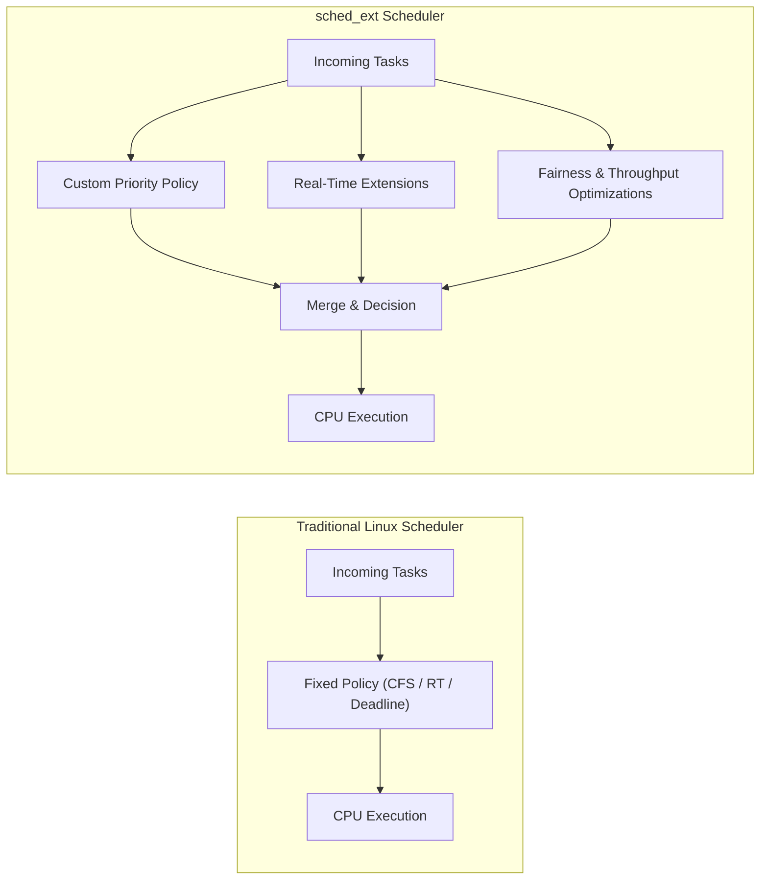

# 3. Scheduler Policies

`sched_ext` enables flexible and programmable scheduling policies in Linux. This chapter explores the main categories of policies that can be implemented using `sched_ext`.

## 3.1 Custom Priority Policies

- Traditional schedulers assign **fixed priorities** to tasks (e.g., RT vs CFS nice values).  
- `sched_ext` allows **dynamic, user-defined priority schemes**, which can be:
  - **Workload-specific** – e.g., prioritizing AI inference threads over background tasks.  
  - **Time-based** – e.g., temporarily boosting priority for short-lived tasks.  
  - **Adaptive** – policies that adjust priorities based on system load or task performance.  

**Example Use Case**: A cloud server might boost latency-sensitive requests dynamically while keeping batch jobs lower priority.

## 3.2 Real-Time Scheduling Extensions

- Real-time tasks require **deterministic execution** with minimal latency.  
- While Linux RT and Deadline schedulers provide basic support, `sched_ext` can enhance it by:
  - Using **custom eBPF logic** for selecting real-time tasks based on custom criteria.  
  - Implementing **deadline-aware scheduling** tailored to specific applications.  
  - Supporting **mixed workloads**, ensuring real-time tasks meet deadlines without starving non-real-time tasks.  

**Example Use Case**: In an industrial control system, critical sensor tasks can preempt non-critical analytics tasks using `sched_ext` logic.

## 3.3 Fairness and Throughput Optimizations

- `sched_ext` enables **fine-grained control** over CPU allocation for fairness and throughput:
  - **Weighted Fairness**: Tasks or groups of tasks can receive CPU time proportionally to weights.  
  - **Throughput Maximization**: Tasks can be batched or co-scheduled to improve cache locality and reduce context switching.  
  - **NUMA Awareness**: Tasks can be scheduled on CPUs closer to memory they access to improve throughput.  

**Example Use Case**: A multi-tenant cloud environment can use `sched_ext` to ensure fair CPU allocation while optimizing throughput for batch jobs.

## ✅ Summary

- **Custom Priority Policies** allow dynamic, workload-aware prioritization of tasks.  
- **Real-Time Scheduling Extensions** enhance deterministic execution for latency-critical workloads.  
- **Fairness and Throughput Optimizations** ensure balanced CPU usage while maximizing system performance.  

`sched_ext` provides the **flexibility to implement and experiment** with these policies without modifying the kernel core.

### 🔎 Explanation:
- **Traditional Scheduler**: Tasks are funneled into **one hardcoded policy path** before execution.  
- **sched_ext**: Tasks can be **handled by multiple parallel policies** (priority, real-time, fairness), merged, and then dispatched.  

This makes sched_ext **far more flexible** for experimentation and workload-specific optimization.  

