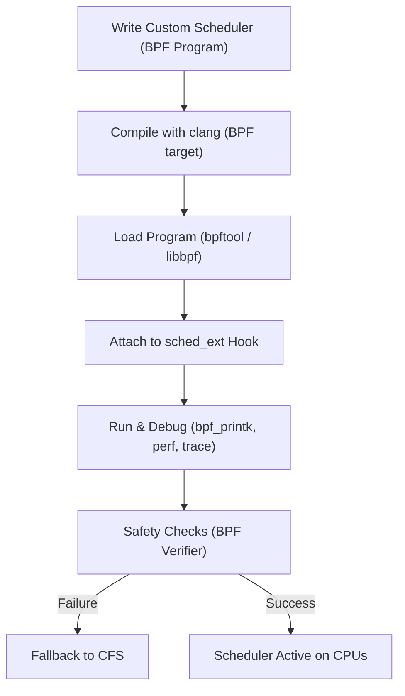
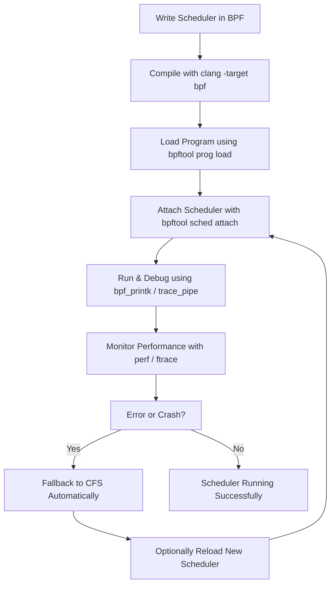

# 4. Implementation Guide

This chapter provides a step-by-step guide to building, loading, debugging, and safely managing custom schedulers with `sched_ext`.


## 4.1 Writing a Custom Scheduler in BPF

Custom schedulers in `sched_ext` are written using **eBPF programs**. Unlike traditional schedulers hardcoded into the kernel, these can be compiled, loaded, and replaced dynamically.
- **Language**: Custom schedulers are written in **eBPF** (Extended Berkeley Packet Filter) programs.
- **Structure**:
  - Define task selection logic (which task runs next).
  - Implement queue management policies (fairness, priority, deadlines).
  - Provide hooks for load balancing and CPU assignment.

### Example: A Simple Priority-Based Scheduler
  ```c
    SEC("sched_ext")
    int pick_task(struct task_struct *task) {
        // Custom logic: always select the highest-priority task
        struct task_struct *best = NULL;
        struct task_struct *t;

        for_each_task(t) {
            if (!best || t->prio > best->prio) {
                best = t;
            }
        }
        return best->pid;
    }
  ```
**Explanation**:
- Iterates through the available tasks.
- Chooses the one with the **highest priority value**.
- Returns the PID for execution.

## 4.2 Attaching and Loading Scheduler Programs

After writing the BPF program, you need to **compile and attach** it to the kernel.

### Step 1: Compile the Scheduler
  ```bash
    clang -O2 -target bpf -c my_sched.c -o my_sched.o
  ```
### Step 2: Load and Attach with bpftool
  ```bash
    bpftool prog load my_sched.o /sys/fs/bpf/my_sched
    bpftool sched attach my_sched
  ```
**Alternative (C API via libbpf):**

  ```c
    struct bpf_object *obj;
    obj = bpf_object__open("my_sched.o");
    bpf_object__load(obj);
    bpf_sched_attach(obj, "my_sched");
  ```
## 4.3 Debugging Tools and Logs

Debugging custom schedulers is critical since incorrect logic can affect performance or stability.

### Logging with bpf_printk
  ```c
    SEC("sched_ext")
    int pick_task(struct task_struct *task) {
        bpf_printk("Evaluating task %d with priority %d\n", task->pid, task->prio);
        return task->pid;
    }
  ```
Check logs in real time:

  ```bash
    sudo cat /sys/kernel/debug/tracing/trace_pipe
  ```
### Monitoring with perf / ftrace

- **perf sched** – Track scheduling latency and context switches.
- **ftrace** – Trace kernel functions related to scheduling.


## 4.4 Safety and Recovery Mechanisms

One of the key features of `sched_ext` is **safety by design**.

### Safety

- **Verifier**: Ensures the BPF program does not access invalid memory or run indefinitely.
- **Resource checks**: Prevents schedulers from monopolizing CPU time.

### Recovery

- **Automatic fallback**: If the custom scheduler crashes or fails verification, the kernel **falls back to CFS**.
- **Manual recovery**: An admin can detach the custom scheduler:
    ```bash
      bpftool sched detach
      echo "Falling back to CFS..."
    ```

- **Hot Reloading**: Replace the scheduler without rebooting:
    ```bash
      bpftool prog load new_sched.o /sys/fs/bpf/new_sched
      bpftool sched attach new_sched
    ```
---

## ✅ Summary

- **Writing**: Implement task selection logic in eBPF.  
- **Attaching**: Use `clang` + `bpftool` (or libbpf) to load and attach.  
- **Debugging**: Use `bpf_printk`, `perf`, and `ftrace` to monitor scheduler decisions.  
- **Safety**: The verifier enforces correctness, and CFS provides a fallback.  

This workflow makes `sched_ext` **safe for experimentation** and **powerful for production workloads**.




### 🔎 Explanation:
- **Steps Write Custom Scheduler  → Scheduler Active on CPUs** show the full lifecycle of a custom scheduler.  
- The **BPF verifier** ensures safety before activation.  
- If anything goes wrong, the system **automatically falls back** to CFS.  

## Step-by-step flow of implementing a custom scheduler with sched_ext:


