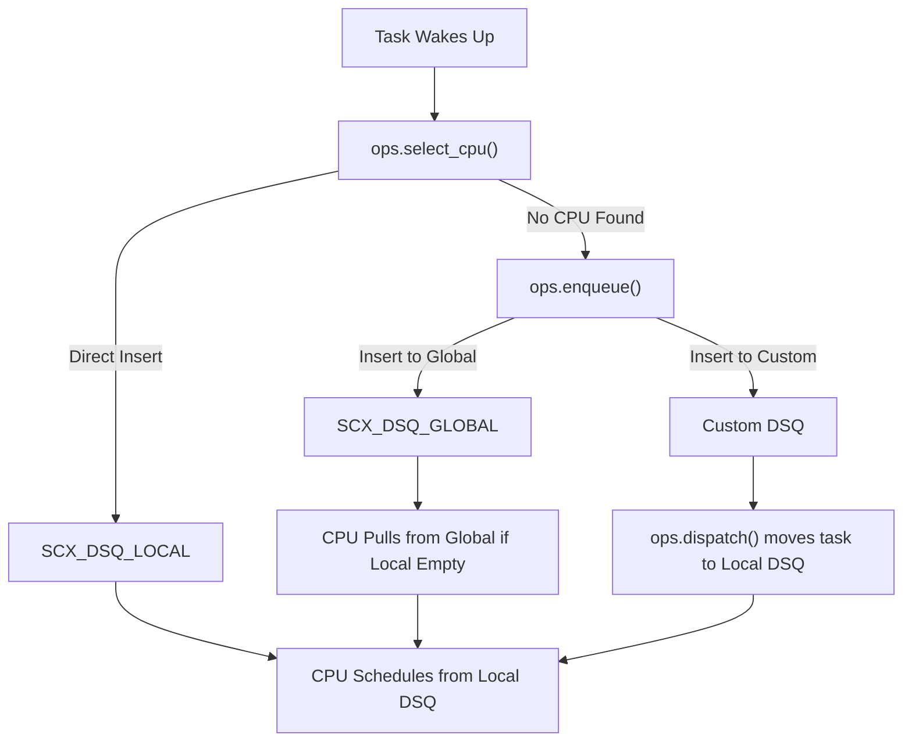
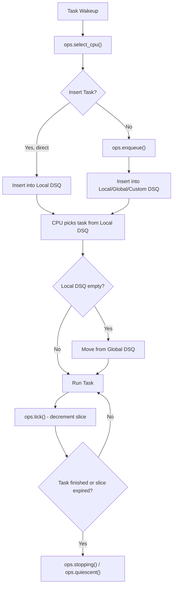
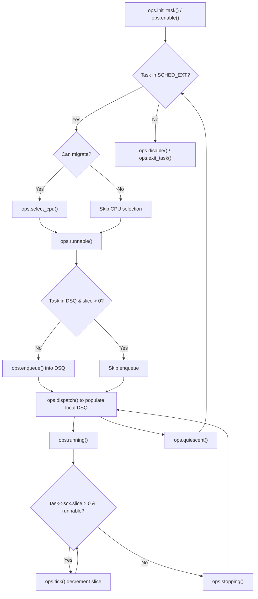

# 5. Extensible Scheduler Class

`sched_ext` is a Linux kernel scheduler class whose behavior can be defined entirely by a set of **BPF programs**, referred to as the **BPF scheduler**. This allows developers to implement custom scheduling algorithms in a modular, dynamic, and safe manner.


## 5.1 Key Features

- **Full Scheduling Interface:** `sched_ext` exports a complete scheduling interface so that any scheduling algorithm can be implemented.
- **CPU Grouping:** The BPF scheduler can group CPUs arbitrarily and schedule them together; tasks are not tied to specific CPUs at wakeup.
- **Dynamic Activation:** The BPF scheduler can be turned on or off at runtime.
- **Safety & Integrity:** System integrity is always maintained. If an error occurs, a runnable task stalls, or the SysRq key sequence `SysRq-S` is invoked, the default scheduling behavior is restored.
- **Debugging:** If the BPF scheduler triggers an error, debug information is dumped to aid debugging. It can be accessed through `sched_ext_dump` tracepoint or via `SysRq-D`.


## 5.2  To enable `sched_ext`

To enable `sched_ext`, the kernel must be compiled with the following options:

```text
CONFIG_BPF=y
CONFIG_SCHED_CLASS_EXT=y
CONFIG_BPF_SYSCALL=y
CONFIG_BPF_JIT=y
CONFIG_DEBUG_INFO_BTF=y
CONFIG_BPF_JIT_ALWAYS_ON=y
CONFIG_BPF_JIT_DEFAULT_ON=y
CONFIG_PAHOLE_HAS_SPLIT_BTF=y
CONFIG_PAHOLE_HAS_BTF_TAG=y
```

## 5.3 Behavior

- Tasks with **`SCHED_EXT`** policy are initially treated as **`SCHED_NORMAL`** and scheduled by the fair scheduler until the BPF scheduler is loaded.

- When the BPF scheduler is active:

  - **Full mode:** All `SCHED_NORMAL`, `SCHED_BATCH`, `SCHED_IDLE`, and `SCHED_EXT` tasks are handled by `sched_ext`.

  - **Partial mode (`SCX_OPS_SWITCH_PARTIAL`):** Only `SCHED_EXT` tasks are scheduled by `sched_ext`; other tasks continue to be scheduled by the fair-class scheduler.

- Termination of the BPF scheduler or detection of internal errors automatically reverts all tasks back to the fair-class scheduler.

## 5.4 Checking Scheduler Status
```bash
# Check if BPF scheduler is enabled
$ cat /sys/kernel/sched_ext/state
enabled

# Check current scheduler operations
$ cat /sys/kernel/sched_ext/root/ops
simple

# Check if a BPF scheduler has ever been loaded
$ cat /sys/kernel/sched_ext/enable_seq
1
```
You can also use the `tools/sched_ext/scx_show_state.py` drgn script for detailed state inspection.

## 5.5 Implementing a BPF Scheduler

Userspace can implement a custom scheduler by providing a set of BPF programs implementing struct sched_ext_ops. The only mandatory field is ops.name.

### Example: Minimal Global FIFO Scheduler

```c
s32 BPF_STRUCT_OPS(simple_select_cpu, struct task_struct *p, s32 prev_cpu, u64 wake_flags) {
    s32 cpu;
    bool direct = false;
    cpu = scx_bpf_select_cpu_dfl(p, prev_cpu, wake_flags, &direct);
    if (direct)
        scx_bpf_dsq_insert(p, SCX_DSQ_LOCAL, SCX_SLICE_DFL, 0);
    return cpu;
}

void BPF_STRUCT_OPS(simple_enqueue, struct task_struct *p, u64 enq_flags) {

    scx_bpf_dsq_insert(p, SCX_DSQ_GLOBAL, SCX_SLICE_DFL, enq_flags);
}

void BPF_STRUCT_OPS(simple_dispatch, s32 cpu, struct task_struct *prev) {

    scx_bpf_consume(SHARED_DSQ);
}

s32 BPF_STRUCT_OPS_SLEEPABLE(simple_init){

	if (!switch_partial)
		scx_bpf_switch_all();

	return scx_bpf_create_dsq(SHARED_DSQ, -1);
}

void BPF_STRUCT_OPS(simple_exit, struct scx_exit_info *ei){

    exit_type = ei->type;
}

SEC(".struct_ops")
struct sched_ext_ops simple_ops = {
    .select_cpu = (void *)simple_select_cpu,
    .enqueue    = (void *)simple_enqueue,
    .dispatch	= (void *)simple_dispatch,
    .running	= (void *)simple_running,
    .stopping	= (void *)simple_stopping,
    .init       = (void *)simple_init,
    .exit       = (void *)simple_exit,
    .name       = "simple",
};

```

## 5.6 Dispatch Queues (DSQs)

`sched_ext` uses **Dispatch Queues (DSQs)** to decouple task insertion from CPU execution:

### Types of DSQs
- **Global DSQ:** `SCX_DSQ_GLOBAL` – tasks available system-wide.
- **Local DSQ:** `SCX_DSQ_LOCAL` – one per CPU for tasks ready to run on that CPU.
- **Custom DSQs:** Can be created dynamically using `scx_bpf_create_dsq()`.

### Task Execution Flow
1. CPU picks task from its **local DSQ**.
2. If local DSQ is empty, attempt to move tasks from the **global DSQ**.
3. If still empty, `ops.dispatch()` is called to populate the DSQ.

### Insertion Options via `scx_bpf_dsq_insert()`
- Insert into **local DSQ**
- Insert into **global DSQ**
- Insert into **custom DSQ**
- Priority insertion using `scx_bpf_dsq_insert_vtime()`

### Scheduling Cycle
1. `ops.select_cpu()` is invoked when a task wakes up, providing a CPU optimization hint.
2. Task can be immediately inserted into a **DSQ** (local/global).
3. `ops.enqueue()` is invoked for tasks not inserted in the previous step.
4. CPU picks tasks from **local DSQ**, then **global DSQ**, and finally calls `ops.dispatch()` if none are available.
5. Task runs, slices are decremented via `ops.tick()`.
6. `ops.stopping()` and `ops.quiescent()` handle task exit or idle state.

#### Diagram of Scheduling life Cycle

#### Scheduling Cycle

**Scope:** *CPU + system view*  

Describes how the scheduler makes decisions repeatedly whenever CPUs need work.

It includes:

- A task wakes up → `ops.select_cpu()` is invoked.  
- If directly inserted into a DSQ → immediate scheduling.  
- Otherwise → `ops.enqueue()` decides where to put it.  
- When CPU is ready → look in local DSQ → fallback to global DSQ → finally `ops.dispatch()` is called if still empty.  
- Run the task until slice expires (`ops.tick()` + `ops.stopping()`), then repeat.  

👉 Think of it as **the loop of CPU scheduling decisions**, not the whole lifetime of a task.  

## 5.7 Task Lifecycle & Pseudo-Code
### Task Lifecycle

**Scope:** *Per-task view*  

Describes everything that happens to a single task from its creation until its exit, while being managed under `sched_ext`.

It includes:

- `ops.init_task()` → initialization when task is created.  
- `ops.enable()` → task becomes sched_ext-managed.  
- `ops.select_cpu()` → choose CPU (on wakeup).  
- `ops.enqueue()` / `ops.dispatch()` → getting into DSQs.  
- `ops.running()`, `ops.tick()` → execution and slice management.  
- `ops.stopping()`, `ops.quiescent()` → stopping or waiting.  
- `ops.disable()`, `ops.exit_task()` → cleanup on exit.  

👉 Think of it as **the life journey of one task** inside `sched_ext`.  

### Pseudo-Code
```c
ops.init_task();
ops.enable();

while (task in SCHED_EXT) {
    if (task can migrate)
        ops.select_cpu();
    ops.runnable();
    while (task is runnable) {
        if (task not in DSQ && task->scx.slice == 0)
            ops.enqueue();
        ops.dispatch();
        ops.running();
        while (task->scx.slice > 0 && runnable)
            ops.tick();
        ops.stopping();
        ops.dispatch();
    }
    ops.quiescent();
}

ops.disable();
ops.exit_task();
```


### Detailed

### Task Lifecycle Summary in sched_ext

- **Initialization**: Prepare and enable the task for BPF scheduling.

- **CPU selection & ready state**: Determine where it should run and mark as runnable.

- **Enqueue and dispatch**: Place tasks in Dispatch Queues (DSQs) and ensure CPUs have tasks to execute.

- **Execution**: Run the task and decrement time slices via ticks.

- **Stopping & waiting**: Handle task pause, exit, or blocked states.

- **Cleanup**: Disable BPF scheduling and exit the task properly.

## 5.8 Reference Files

- **include/linux/sched/ext.h** – Data structures, ops table, constants.  
- **kernel/sched/ext.c** – Core implementation, helpers.  
- **tools/sched_ext/** – Example BPF scheduler implementations (`scx_simple`, `scx_qmap`).  

## 5.9 Important Notes

- The APIs provided by `sched_ext` are **unstable** and may change between kernel versions.  
- BPF scheduler programs must be **verified by the kernel** before execution.  
- Care must be taken when using **custom DSQs** and task insertion to avoid **race conditions**.  

## ✅ Summary

`sched_ext` transforms Linux scheduling into a **flexible, programmable, BPF-driven system**, allowing rapid experimentation with custom scheduling policies while **preserving system stability** and providing **rich debugging support**.


## 🔹 Visual Comparison: Task Lifecycle vs Scheduling Cycle

```mermaid
flowchart TD

    subgraph TaskLifecycle["Task Lifecycle (Per Task)"]
        A["ops.init_task()"] --> B["ops.enable()"]
        B --> C["ops.select_cpu()"]
        C --> D["ops.enqueue() / ops.dispatch()"]
        D --> E["ops.running()"]
        E --> F["ops.tick()"]
        F --> G["ops.stopping()"]
        G --> H["ops.quiescent()"]
        H --> I["ops.disable()"]
        I --> J["ops.exit_task()"]
    end

    subgraph SchedulingCycle["Scheduling Cycle (CPU/System Loop)"]
        K[Task wakes up] --> L["ops.select_cpu()"]
        L --> M{Inserted directly into DSQ?}
        M -->|Yes| N[Immediate scheduling]
        M -->|No| O["ops.enqueue()"]
        O --> P{Local DSQ has tasks?}
        P -->|Yes| Q[Pick from Local DSQ]
        P -->|No| R{Global DSQ has tasks?}
        R -->|Yes| S[Pick from Global DSQ]
        R -->|No| T["ops.dispatch()"]
        Q --> U[Run task]
        S --> U
        T --> U
        U --> V["ops.tick() + ops.stopping()"]
        V --> P
    end
```


