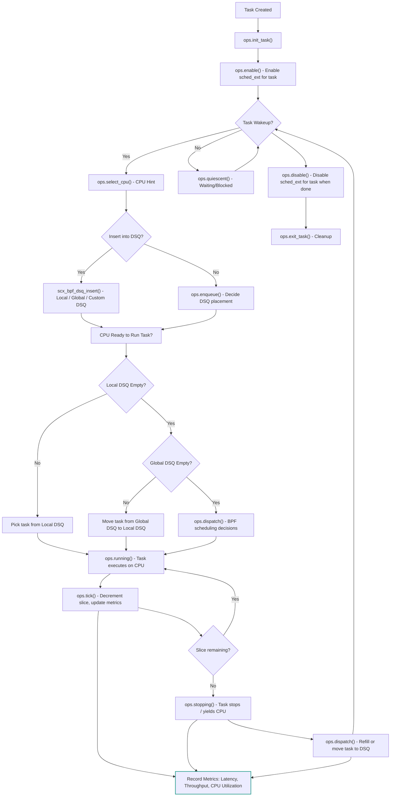

## 7. Performance Evaluation

Evaluating a scheduler’s performance is crucial to understand its efficiency, responsiveness, and suitability for various workloads. For `sched_ext`, performance evaluation involves measuring traditional scheduling metrics as well as the benefits introduced by BPF-driven customization.

### 7.1 Metrics for Scheduler Efficiency

To assess `sched_ext`, the following metrics are commonly used:

- **Latency**:  
  Measures the time taken for a task to start executing after it becomes runnable.  
  - Low-latency workloads (e.g., audio processing, trading systems) benefit from deterministic latency.
  
- **Throughput**:  
  Number of tasks or jobs completed per unit time.  
  - High-throughput workloads, like batch jobs or AI/ML training, benefit from efficient CPU utilization.

- **Fairness**:  
  Ensures no single task or tenant monopolizes CPU resources.  
  - Can be quantified using metrics such as Jain’s fairness index or per-tenant CPU usage.

- **CPU Utilization**:  
  Measures the fraction of time CPUs spend executing runnable tasks versus idling.

- **Preemption and Context Switch Overhead**:  
  Tracks how often tasks are preempted or switched, indicating the scheduler’s efficiency in task placement and DSQ management.

- **Task Migration Cost**:  
  Measures the overhead of moving tasks between CPUs, particularly important when using multiple DSQs.

- **Energy Efficiency (Optional)**:  
  For energy-aware scheduling, measures power consumed per unit of work completed.

### 7.2 Benchmarking `sched_ext` vs CFS

Benchmarking `sched_ext` against the default Linux Completely Fair Scheduler (CFS) helps quantify its benefits:

- **Setup**:  
  - Use identical hardware and workloads to ensure fair comparison.
  - Compare scenarios with default CFS and custom BPF schedulers implemented in `sched_ext`.

- **Workloads**:  
  - Low-latency tasks: micro-benchmarks with tight response requirements.  
  - High-throughput tasks: batch processing or AI/ML training jobs.  
  - Mixed workloads: combining latency-sensitive and long-running tasks.

- **Evaluation**:  
  - Measure average and 95th percentile latency for latency-sensitive tasks.  
  - Calculate total throughput for compute-intensive workloads.  
  - Record fairness across multiple tenants or task groups.  
  - Evaluate DSQ utilization and effectiveness of local vs global queues.

- **Observations**:  
  - `sched_ext` can reduce latency for critical tasks by bypassing fair scheduling.  
  - CPU utilization can improve with workload-specific DSQ dispatching.  
  - Fairness is maintained or configurable per workload, unlike hard-coded policies in CFS.  
  - Task migration is more controlled, reducing unnecessary cache misses.

### 7.3 Case Studies

#### Case Study 1: Low-Latency Media Server
- **Problem**: Audio streams were experiencing jitter under CFS.  
- **Solution**: `sched_ext` with separate DSQs for audio and background encoding tasks.  
- **Result**: Audio latency reduced by 40–60%, predictable scheduling maintained for high-priority streams.

#### Case Study 2: Multi-Tenant Cloud Environment
- **Problem**: Tenant workloads competed for CPU, leading to unfair sharing.  
- **Solution**: `sched_ext` enforced tenant-specific DSQs and weighted CPU quotas.  
- **Result**: CPU allocation adhered to tenant quotas, reducing noisy neighbor effects and increasing system predictability.

#### Case Study 3: AI/ML Training Cluster
- **Problem**: Long-running training tasks delayed short control operations, slowing convergence.  
- **Solution**: Tasks categorized dynamically into priority DSQs.  
- **Result**: Gradient update tasks ran with minimal delay, training convergence improved, and CPU utilization remained high.

#### Case Study 4: Research Prototypes
- **Problem**: Kernel modification was required to test new scheduling algorithms.  
- **Solution**: Prototype algorithms implemented in BPF via `sched_ext`.  
- **Result**: Safe experimentation with fallback to default scheduler, detailed debugging via `sched_ext_dump`.

✅ **Conclusion**:  
Performance evaluation demonstrates that `sched_ext` provides measurable improvements in latency, throughput, and fairness while offering flexibility for workload-specific scheduling policies. Its BPF-based approach allows for safe, modular experimentation without compromising system stability.

