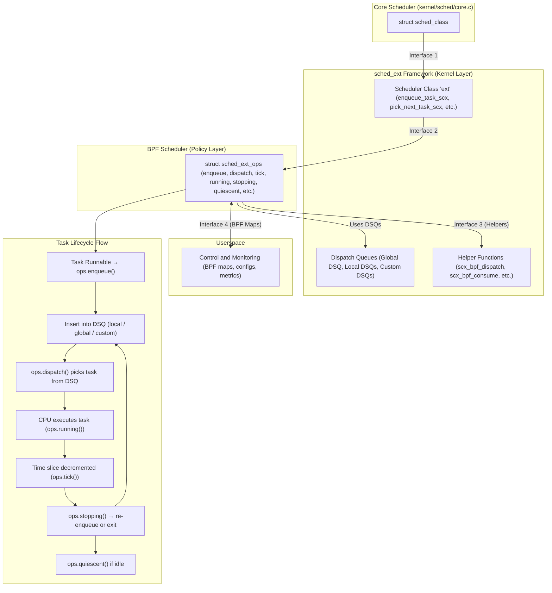
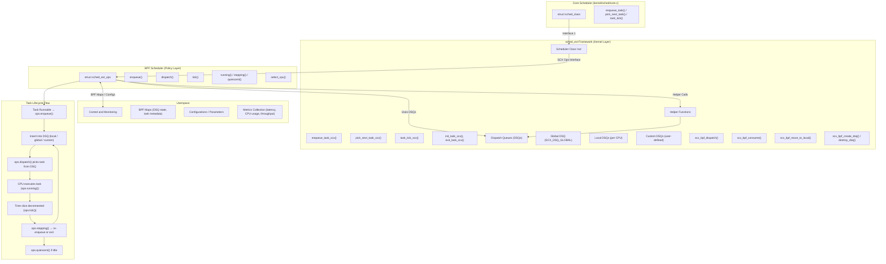
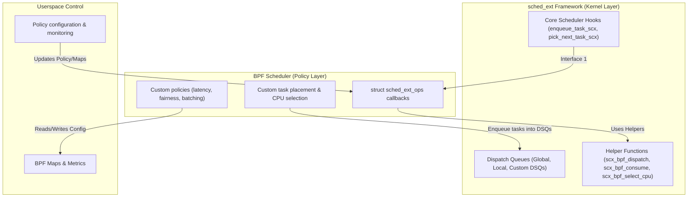

# Scheduler Architecture & Key Interfaces

`sched_ext` as built in layers, each with defined interfaces that communicate upward and downward:

---

## Layered Architecture

**Core Kernel Scheduler**  
- The base scheduling logic (in `kernel/sched/core.c`) defines core abstractions and operations that all scheduler classes must implement.

**sched_ext Framework (Kernel Layer)**  
- Sits on top of the core scheduler and implements a new scheduler class (`ext`) which satisfies the core scheduler’s interface (`struct sched_class`). The framework handles bridging to BPF and managing queues (local, global, custom).

**BPF Scheduler (Policy Layer)**  
- The BPF program implements `struct sched_ext_ops` callbacks (enqueue, dispatch, running, stopping, quiescent, etc.), defining custom behavior for scheduling decisions.

**Userspace Component**  
- A userspace program (C, Rust, etc.) interacts with the BPF scheduler via BPF maps, configuration, metrics, and control, enabling runtime updates and monitoring.

---

## Key Interfaces & Callbacks

Changwoo labels the interactions between these layers as Interface 1 through Interface 4:

### Interface 1: Core → sched_ext

- Core scheduler calls `enqueue_task`, `pick_next_task`, `update_curr` via `struct sched_class`.
- `sched_ext` installs its own implementations (`enqueue_task_scx`, `pick_next_task_scx`) to satisfy those hooks.  
- **Example:** When a task becomes runnable, `enqueue_task_scx()` delegates to `scx_ops.enqueue()` in the BPF scheduler.

### Interface 2: sched_ext → BPF Scheduler

- The framework passes arguments and context to BPF callbacks (`enqueue`, `dispatch`, `tick`, etc.).
- Provides default implementations if BPF scheduler does not override specific callbacks.

### Interface 3: BPF Scheduler → sched_ext

- The BPF scheduler uses helper functions to manage dispatch queues, select CPUs, move tasks, and wake idle CPUs.
- **Examples of helpers:**
  - `scx_bpf_create_dsq()`, `scx_bpf_destroy_dsq()`  
  - `scx_bpf_dispatch()`, `scx_bpf_dispatch_vtime()`  
  - `scx_bpf_consume()`, `scx_bpf_consume_task()`  
  - `scx_bpf_select_cpu_dfl()`  
  - `scx_bpf_kick_cpu()`
- **Dispatch Queues (DSQs)** mediate task delivery to CPU-local queues.

### Interface 4: BPF ↔ Userspace

- Userspace programs can read/write BPF maps, configure the scheduler, or monitor metrics.
- Allows dynamic updates, policy changes, and control of scheduling behavior at runtime.

---
## Diagram of the interaction between the sched_ext Framework (Kernel Layer) and the BPF Scheduler (Policy Layer)

### How to read this:

- Framework sits on top of the core scheduler, exposing hooks and helpers.

- BPF Scheduler implements custom scheduling logic using struct sched_ext_ops.

- Tasks flow from core scheduler → framework → BPF scheduler for decisions.

- DSQs (Dispatch Queues) are managed by the framework but populated according to the BPF policy.

- Userspace can read/write BPF maps for metrics or update scheduler policies at runtime.